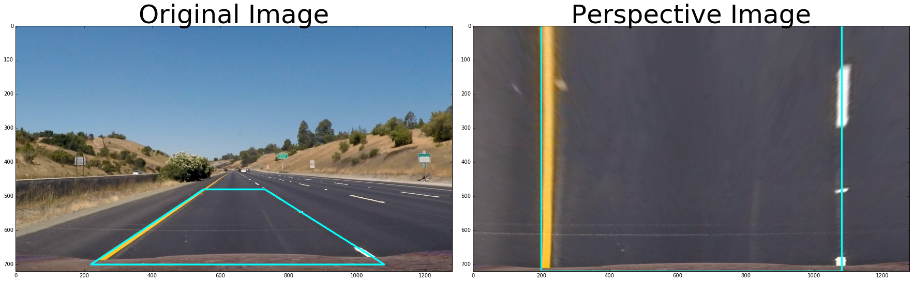
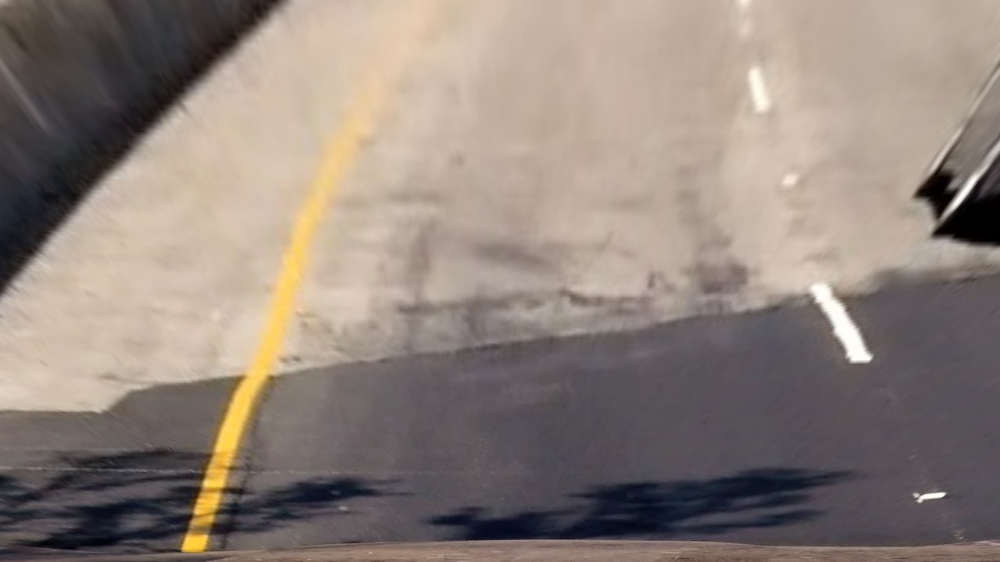
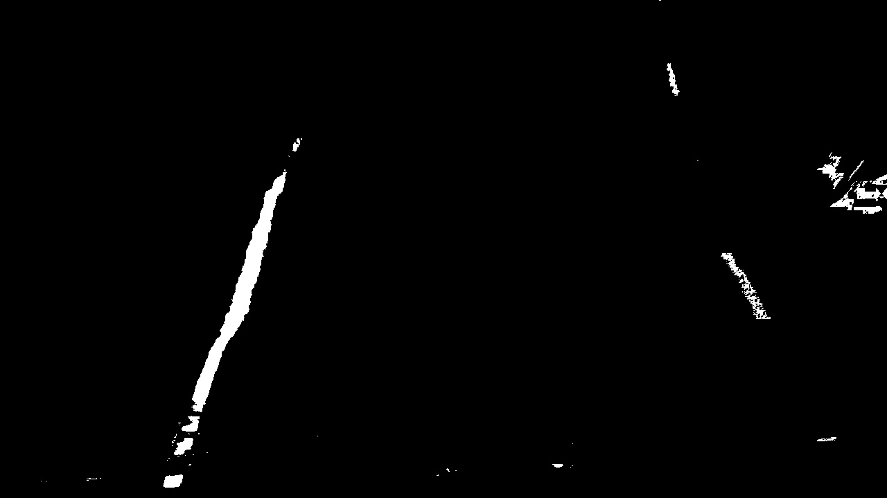
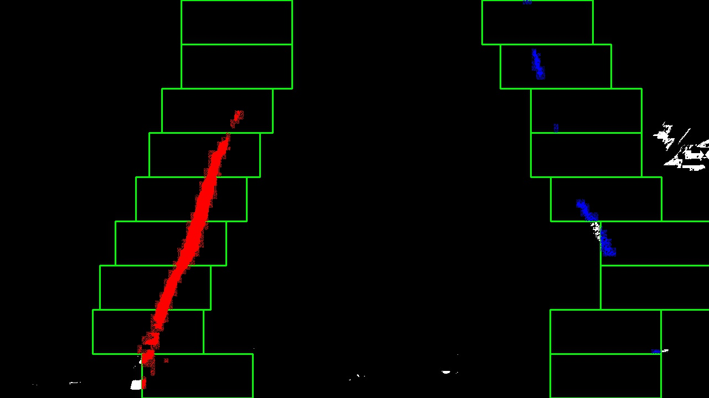
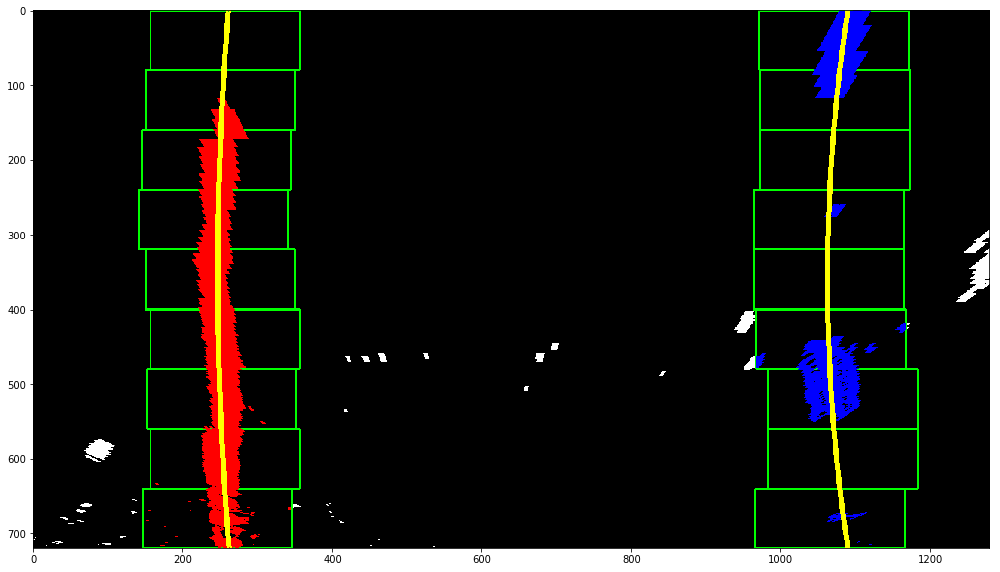
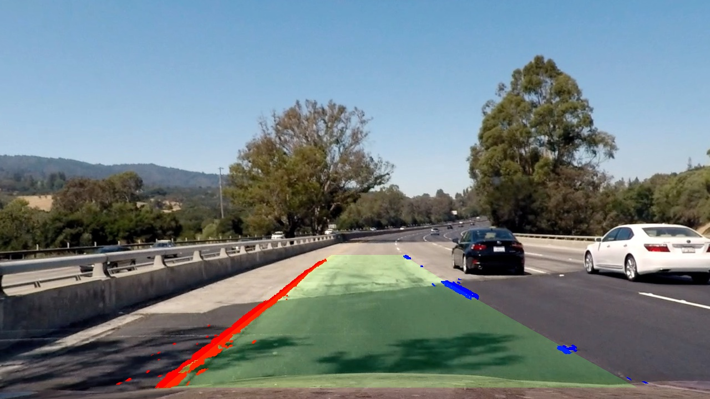
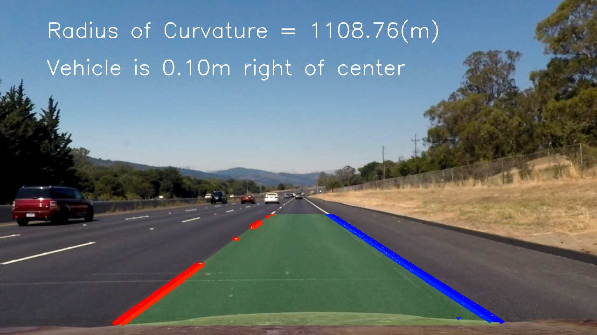

# Self-Driving Car Engineer Nanodegree

## **Advanced Lane Finding on the Road** 

<br>

---
## Overview

In this project, I will write a software pipeline to identify the lane boundaries in a video from a front-facing camera on a car. The camera calibration images, test road images, and project videos are available in the [project repository](https://github.com/miguelangel/sdc--advanced-lane-finding).

The complete pipeline can be found [here](https://github.com/miguelangel/sdc--finding-lane-lines/blob/master/finding_lane_lines.ipynb).

## Goals/Steps
**Advanced Lane Finding Project**

The goals / steps of this project are the following:

1. Compute the camera calibration matrix and distortion coefficients given a set of chessboard images.
2. Apply a distortion correction to raw images.
3. Use color transforms, gradients, etc., to create a thresholded binary image.
4. Apply a perspective transform to rectify binary image ("birds-eye view").
5. Detect lane pixels and fit to find the lane boundary.
6. Determine the curvature of the lane and vehicle position with respect to center.
7. Warp the detected lane boundaries back onto the original image.
8. Output visual display of the lane boundaries and numerical estimation of lane curvature and vehicle position.

---

### Step 1: Camera Calibration

The code for this step is contained in the first code cell of the IPython notebook located in "./examples/calibration.py" 

I start by preparing "object points", which will be the (x, y, z) coordinates of the chessboard corners in the world. Here I am assuming the chessboard is fixed on the (x, y) plane at z=0, such that the object points are the same for each calibration image.  Thus, `objp` is just a replicated array of coordinates, and `objpoints` will be appended with a copy of it every time I successfully detect all chessboard corners in a test image.  `imgpoints` will be appended with the (x, y) pixel position of each of the corners in the image plane with each successful chessboard detection.  

### Step 2: Apply a distortion correction to raw images
I then used the output `objpoints` and `imgpoints` to compute the camera calibration and distortion coefficients using the `cv2.calibrateCamera()` function.  I applied this distortion correction to the test image using the `cv2.undistort()` function and obtained this result: 


### Step 3: Use color transforms, gradients
Mutiple color transforms are used in this project. Then combine these color transforms to filter the edge of image.

#### 1. Gradient Sobel x 

<br>

#### 2. Gradient Sobel y 

<br>

#### 3. Gradient magnitude

<br>

#### 4. Gradient direction

<br>

#### 5. HLS Color Space

<br>

### Step 4: Apply a perspective transform to rectify binary image ("birds-eye view").
The code for my perspective transform, which appears in lines 10 through 31 in the file `./examples/curve_perspective.py` (output_images/examples/example.py).  This .py file takes as inputs an image (`img`), as well as source (`src`) and destination (`dst`) points.  I chose the hardcode the source and destination points in the following manner:

```python
src = np.float32(
    [[480,450],
    [800,450],
    [80,700],
    [1200,700]])
dst = np.float32(
    [[0, 0], 
    [img_size[0], 0],
    [img_size[0], img_size[1]], 
    [0, img_size[1]]])
```

This resulted in the following source and destination points:

| Source        | Destination   | 
|:-------------:|:-------------:| 
| 480, 450      | 0, 0        | 
| 800, 450      | 960, 0      |
| 80,  700      | 960, 720      |
| 80, 700       | 0, 720        |

I verified that my perspective transform was working as expected by drawing the `src` and `dst` points onto a test image and its warped counterpart to verify that the lines appear parallel in the warped image.


### Step 5: Detect lane pixels and fit to find the lane boundary
In order to detect lane pixels, I should use a perspective image.

<br>
Because this image already process by color transforms, we will get following image.

<br>
Then, detect lane pixels in Sliding Windows. Find the max value of every windows and mark it.

<br>

Use these lane pixels to fit a polynomial. By this way, we could detect a curve.

<br>

### Step 6: Determine the curvature of the lane and vehicle position with respect to center.
#### Curvature
After we got two lane lines, we could calculate the curvature of each lane. Curvature could help us determine the curve is to left or right.
#### Vehicle position with respect to center
The way to get vehicle position. Just to find the center of image. Then compare the middle of lane and the center of image, we could know the position of vehicle.

### Step 7: Warp the detected lane boundaries back onto the original image.
After we get the lane boundaries by mentioned steps, we could use it to lane boundaries.
Now it's time to warp the detected lane boundaries back onto the original image. Cover translucent lane boundaries onto the original image.


<br>

### Step 8: Output visual display of the lane boundaries and numerical estimation of lane curvature and vehicle position
In addition to cover translucent lane boundaries onto the original image, we should show up numerical estimation of lane curvature and vehicle position too.


<br>

### Video
Here's a link to my video result
https://www.youtube.com/watch?v=WUY5YdGOJxM

---

### Discussion

#### 1. Briefly discuss any problems / issues you faced in your implementation of this project.  Where will your pipeline likely fail?  What could you do to make it more robust?
Here I'll talk about the approach I took, what techniques I used, what worked and why, where the pipeline might fail and how I might improve it if I were going to pursue this project further.  

#####  Briefly discuss any problems / issues you faced in your implementation of this project. 
fail to process challenge_video.mp4
fail to process harder_challenge_video.mp4

##### Where will your pipeline likely fail?
Create a thresholded binary image: It's hard to define a good threshold to fit every environment. 
1. Sometimes the saturation of line is too low, it would lead my algorithm hard to detect it. 
2. Sometimes I would recognize wheel as lanes lines, because its color is closing white. 

##### What could you do to make it more robust?
Combine multiple algorithms to achieve my goal. For example: Sobel, HLS 
