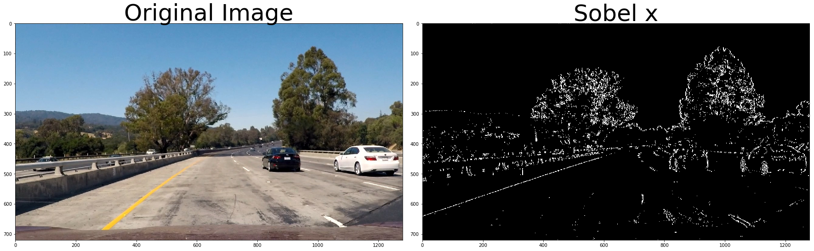
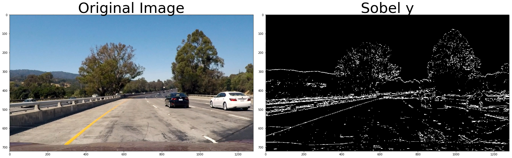
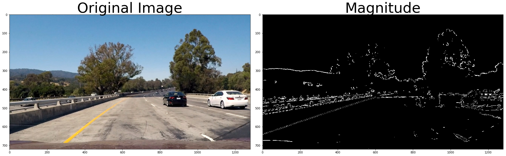
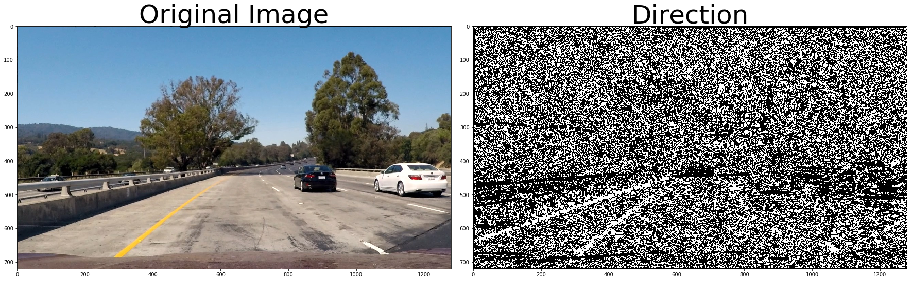
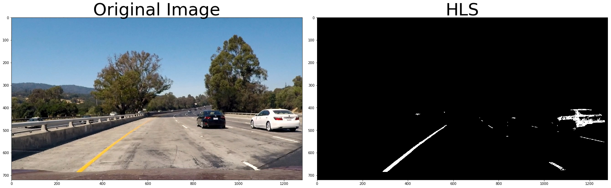
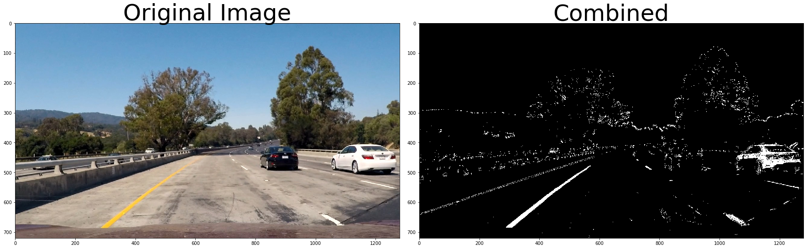

# Self-Driving Car Engineer Nanodegree

## **Advanced Lane Finding on the Road** 


---
## Overview

In this project, I will write a software pipeline to identify the lane boundaries in a video from a front-facing camera on a car. The camera calibration images, test road images, and project videos are available in the [project repository](https://github.com/miguelangel/sdc--advanced-lane-finding).

The complete pipeline can be found [here](https://github.com/miguelangel/sdc--finding-lane-lines/blob/master/finding_lane_lines.ipynb).

## Goals/Steps
**Advanced Lane Finding Project**

The goals / steps of this project are the following:

1. Compute the camera calibration matrix and distortion coefficients given a set of chessboard images.
2. Apply a distortion correction to raw images.
3. Use color transforms, gradients, etc., to create a thresholded binary image.
4. Apply a perspective transform to rectify binary image ("birds-eye view").
5. Detect lane pixels and fit to find the lane boundary.
6. Determine the curvature of the lane and vehicle position with respect to center.
7. Warp the detected lane boundaries back onto the original image.
8. Output visual display of the lane boundaries and numerical estimation of lane curvature and vehicle position.

[//]: # (Image References)

[image1]: ./examples/undistort_output.png "Undistorted"
[image2]: ./test_images/test1.jpg "Road Transformed"
[image3]: ./examples/binary_combo_example.jpg "Binary Example"
[image4]: ./examples/warped_straight_lines.jpg "Warp Example"
[image5]: ./examples/color_fit_lines.jpg "Fit Visual"
[image6]: ./examples/example_output.jpg "Output"
[video1]: ./project_video.mp4 "Video"

---

### Step 1: Camera Calibration

The code for this step is contained in the first code cell of the IPython notebook located in "./examples/calibration.py" 

I start by preparing "object points", which will be the (x, y, z) coordinates of the chessboard corners in the world. Here I am assuming the chessboard is fixed on the (x, y) plane at z=0, such that the object points are the same for each calibration image.  Thus, `objp` is just a replicated array of coordinates, and `objpoints` will be appended with a copy of it every time I successfully detect all chessboard corners in a test image.  `imgpoints` will be appended with the (x, y) pixel position of each of the corners in the image plane with each successful chessboard detection.  

### Step 2: Apply a distortion correction to raw images
I then used the output `objpoints` and `imgpoints` to compute the camera calibration and distortion coefficients using the `cv2.calibrateCamera()` function.  I applied this distortion correction to the test image using the `cv2.undistort()` function and obtained this result: 


### Step 3: Use color transforms, gradients
Mutiple color transforms are used in this project. Then combine these color transforms to filter the edge of image.

#### 1. Gradient Sobel x 

####2. Gradient Sobel y 

#### 3. Gradient magnitude

#### 4. Gradient direction

#### 5. HLS Color Space


#### Here is an example of a binary result from multiple thresholds:


### Pipeline (single images)

#### 1. Provide an example of a distortion-corrected image.

I use images in ./test_images as my source image. Most of time I use ./test_images/test4.jpg to check my algorithm.

#### 2. Describe how (and identify where in your code) you performed a perspective transform and provide an example of a transformed image.

The code for my perspective transform, which appears in lines 10 through 31 in the file `./examples/curve_perspective.py` (output_images/examples/example.py) (or, for example, in the 3rd code cell of the IPython notebook).  This .py file takes as inputs an image (`img`), as well as source (`src`) and destination (`dst`) points.  I chose the hardcode the source and destination points in the following manner:

```python
src = np.float32(
    [[480,450],
    [800,450],
    [80,700],
    [1200,700]])
dst = np.float32(
    [[0, 0], 
    [img_size[0], 0],
    [img_size[0], img_size[1]], 
    [0, img_size[1]]])
```

This resulted in the following source and destination points:

| Source        | Destination   | 
|:-------------:|:-------------:| 
| 480, 450      | 0, 0        | 
| 800, 450      | 960, 0      |
| 80,  700      | 960, 720      |
| 80, 700       | 0, 720        |

I verified that my perspective transform was working as expected by drawing the `src` and `dst` points onto a test image and its warped counterpart to verify that the lines appear parallel in the warped image.

##### Source code path
./examples/curve_perspective.py

##### Result path
./output_images/perspective.jpg

#### 3. Describe how (and identify where in your code) you used color transforms, gradients or other methods to create a thresholded binary image.  Provide an example of a binary image result.

I used a color thresholds to generate a binary image (thresholding steps at lines # through # in `./examples/curve_saturation.py`).  Here's an example of my output for this step.  (note: this is not actually from one of the test images)

##### !!!Before run curve_saturation.py, you should run curve_perspective.py to generate test4_perspective.jpg. 

##### Source code path
./examples/curve_saturation.py

##### Result path
./output_images/test4_perspective_saturation.jpg


#### 4. Describe how (and identify where in your code) you identified lane-line pixels and fit their positions with a polynomial?

Then I did some other stuff and fit my lane lines with a 2nd order polynomial kinda like this:

    # Take a histogram of the bottom half of the image
    # Find the peak of the left and right halves of the histogram
    # These will be the starting point for the left and right lines
   
    # Choose the number of sliding windows
    nwindows = 9
    # Set the width of the windows +/- margin
    margin = 100
    # Set minimum number of pixels found to recenter window
    minpix = 50

    # Set height of windows - based on nwindows above and image shape
    
    # Identify the x and y positions of all nonzero pixels in the image

    
    # Current positions to be updated later for each window in nwindows


    # Create empty lists to receive left and right lane pixel indices

    # Step through the windows one by one
    for window in range(nwindows):
        # Identify window boundaries in x and y (and right and left)

        ### TO-DO: Find the four below boundaries of the window ###

        
        # Draw the windows on the visualization image

        
        ### TO-DO: Identify the nonzero pixels in x and y within the window ###

        
        # Append these indices to the lists

        
        # If you found > minpix pixels, recenter next window on their mean position


    # Concatenate the arrays of indices (previously was a list of lists of pixels)


    # Extract left and right line pixel positions
    return leftx, lefty, rightx, righty, out_img

##### !!!Before run curve_saturation.py, you should run curve_perspective.py to generate test4_perspective_saturation.jpg

##### Source code path
./examples/curve_sliding.py

##### Result path
./output_images/test4_sliding.jpg

#### 5. Describe how (and identify where in your code) you calculated the radius of curvature of the lane and the position of the vehicle with respect to center.

I did this in lines 123 through 144 in my code in `curve_curvature.py`

##### !!!Before run curve_saturation.py, you should run curve_perspective.py to generate test4_perspective_saturation.jpg

##### Source code path
./examples/curve_curvature.py

#### 6. Provide an example image of your result plotted back down onto the road such that the lane area is identified clearly.

I implemented this step in lines 172 through 196 in my code in `./examples/final.py` in the function `unperspective()`.  Here is an example of my result on a test image:

##### Source code path
./examples/final.py

##### Result path

./output_images/processed_images/processed_straight_lines1.jpg
./output_images/processed_images/processed_straight_lines2.jpg
./output_images/processed_images/processed_test1.jpg
./output_images/processed_images/processed_test2.jpg
./output_images/processed_images/processed_test3.jpg
./output_images/processed_images/processed_test4.jpg
./output_images/processed_images/processed_test5.jpg
./output_images/processed_images/processed_test6.jpg
---

### Pipeline (video)

#### 1. Provide a link to your final video output.  Your pipeline should perform reasonably well on the entire project video (wobbly lines are ok but no catastrophic failures that would cause the car to drive off the road!).

Here's a [link to my video result](./project_video.mp4)

##### Result path
./output_video/project_video_output.mp4
./output_video/challenge_video_output.mp4.
./output_video/harder_challenge_output.mp4
---

### Discussion

#### 1. Briefly discuss any problems / issues you faced in your implementation of this project.  Where will your pipeline likely fail?  What could you do to make it more robust?

Here I'll talk about the approach I took, what techniques I used, what worked and why, where the pipeline might fail and how I might improve it if I were going to pursue this project further.  
#####  Briefly discuss any problems / issues you faced in your implementation of this project. 
fail to process challenge_video.mp4
fail to process harder_challenge_video.mp4
##### Where will your pipeline likely fail?
Create a thresholded binary image: It's hard to define a good threshold to fit every environment. 
1. Sometimes the saturation of line is too low, it would lead my algorithm hard to detect it. 
2. Sometimes I would recognize wheel as lanes lines, because its color is closing white. 

##### What could you do to make it more robust?
Combine multiple algorithms to achieve my goal. For example: Sobel, HLS 
